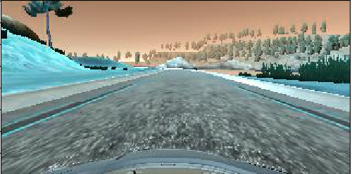
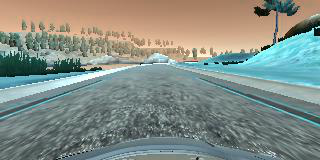
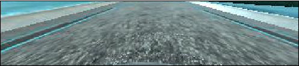
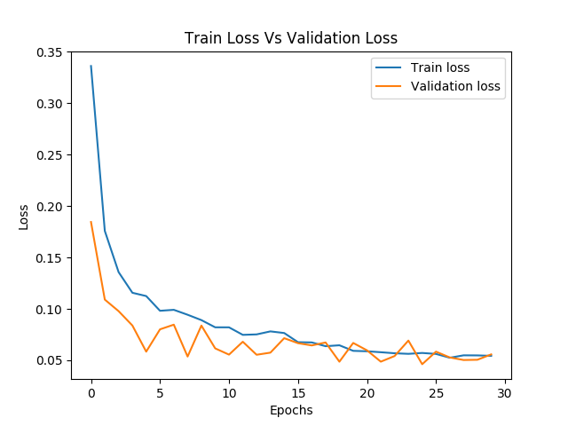

# Behaviorial Cloning Project

Overview
---
This project, involves using  deep neural networks and convolutional neural networks to clone driving behavior by training, validating and testing a model using Keras. The model will output a steering angle to an autonomous vehicle based on the image given as an input.

A simulator is included, where the car can be steered around a track for data collection. The image data and steering angles that was collected was then used to train a neural network and then use this model to drive the car autonomously around the track.


The Project the following five files:
* model.py (script used to create and train the model)
* drive.py (script to drive the car - feel free to modify this file)
* model.h5 (a trained Keras model)
* helper.py (script that contains the helper functions)
* video.mp4 (a video recording of your vehicle driving autonomously around the track for at least one full lap)


### Dependencies
This project requires:

* [CarND Term1 Starter Kit](https://github.com/udacity/CarND-Term1-Starter-Kit)

The lab enviroment can be created with CarND Term1 Starter Kit. Click [here](https://github.com/udacity/CarND-Term1-Starter-Kit/blob/master/README.md) for the details.

## Details About Files In This Directory

### `drive.py`

Usage of `drive.py` requires you have saved the trained model as an h5 file, i.e. `model.h5`. See the [Keras documentation](https://keras.io/getting-started/faq/#how-can-i-save-a-keras-model) for how to create this file using the following command:
```sh
model.save(filepath)
```

Once the model has been saved, it can be used with drive.py using this command:

```sh
python drive.py model.h5
```

The above command will load the trained model and use the model to make predictions on individual images in real-time and send the predicted angle back to the server via a websocket connection.

Note: There is known local system's setting issue with replacing "," with "." when using drive.py. When this happens it can make predicted steering values clipped to max/min values. If this occurs, a known fix for this is to add "export LANG=en_US.utf8" to the bashrc file.

#### Saving a video of the autonomous agent

```sh
python drive.py model.h5 run1
```

The fourth argument, `run1`, is the directory in which to save the images seen by the agent. If the directory already exists, it'll be overwritten.

```sh
ls run1

[2017-01-09 16:10:23 EST]  12KiB 2017_01_09_21_10_23_424.jpg
[2017-01-09 16:10:23 EST]  12KiB 2017_01_09_21_10_23_451.jpg
[2017-01-09 16:10:23 EST]  12KiB 2017_01_09_21_10_23_477.jpg
[2017-01-09 16:10:23 EST]  12KiB 2017_01_09_21_10_23_528.jpg
[2017-01-09 16:10:23 EST]  12KiB 2017_01_09_21_10_23_573.jpg
[2017-01-09 16:10:23 EST]  12KiB 2017_01_09_21_10_23_618.jpg
[2017-01-09 16:10:23 EST]  12KiB 2017_01_09_21_10_23_697.jpg
[2017-01-09 16:10:23 EST]  12KiB 2017_01_09_21_10_23_723.jpg
[2017-01-09 16:10:23 EST]  12KiB 2017_01_09_21_10_23_749.jpg
[2017-01-09 16:10:23 EST]  12KiB 2017_01_09_21_10_23_817.jpg
...
```

The image file name is a timestamp of when the image was seen. This information is used by `video.py` to create a chronological video of the agent driving.

### `video.py`

```sh
python video.py run1
```

Creates a video based on images found in the `run1` directory. The name of the video will be the name of the directory followed by `'.mp4'`, so, in this case the video will be `run1.mp4`.

Optionally, one can specify the FPS (frames per second) of the video:

```sh
python video.py run1 --fps 48
```

Will run the video at 48 FPS. The default FPS is 60.


### `helper.py`

The file consists of all the required functions to extract, combine and load the data.


The following generation function helps return batches of the data and process them on the fly only when needed and not all at once, this helps dealing with big data a lot more efficiently.


```
def generator(samples,batch_size=32):
    """
    samples: The sample of data that is to be preprocessed.
    batch_size: The batch size of the sample that is to be preprocessed.
    """
    num_samples = len(samples)
    while 1:
        sklearn.utils.shuffle(samples)
        for offset in range(0,num_samples,batch_size):
            batch_samples = samples[offset:offset+batch_size]
            images = []
            measurements = []
            for batch_sample in batch_samples:
                measurement = float(batch_sample[3])
                image_path = batch_sample[0]
                image = cv2.imread(image_path)
                images.append(image)

                measurements.append(measurement)

                augmented_image = cv2.flip(image,1)
                images.append(augmented_image)
                augmented_measurement = measurement*-1.0
                measurements.append(augmented_measurement)

            X_train = np.array(images)
            y_train = np.array(measurements)
            yield sklearn.utils.shuffle(X_train,y_train)

```


### `model.py`

The following file defines the model and also trains the model.The following function defines the model.

```
#The Model Architecture
def Model():
    model = Sequential()

    #Normalize the image
    model.add(Lambda(lambda x:x /255.0 - 0.5,input_shape=(160,320,3)))

    #Crop each image, to only include the region of interest (i.e. only the road)
    model.add(Cropping2D(cropping=((70,25),(0,0))))

    model.add(Convolution2D(24,5,5,subsample=(2,2),activation='relu'))
    model.add(Convolution2D(36,5,5,subsample=(2,2),activation='relu'))
    model.add(Convolution2D(48,5,5,subsample=(2,2),activation='relu'))
    model.add(Convolution2D(64,3,3,activation='relu'))
    model.add(Convolution2D(64,3,3,activation='relu'))
    model.add(Flatten())
    model.add(Dense(100))
    model.add(Dropout(0.5))
    model.add(Dense(50))
    model.add(Dropout(0.5))
    model.add(Dense(10))
    model.add(Dense(1))

    model.compile(loss='mse',optimizer='adam')

    return model
```

---

## The Project

The goals / steps of this project are the following:
* Use the simulator to collect data of good driving behavior
* Design, train and validate a model that predicts a steering angle from image data
* Use the model to drive the vehicle autonomously around the first and second track in the simulator. The vehicle should remain on the road for an entire loop around the track.


## Data Collection Strategy
I collected data from both the tracks and for each track I drove the car around the track for 5 laps, both anti-clockwise and clockwise. This because the more data that is collected, the more accurate the final model will be.

Apart from regularly driving the car around the track, I also drove the car off the track and recovered the car to drive back again on to the track. This was done so that data can be collected to train the model to recover from going off the track.

Finally the data from all the driving logs were combined, in order to pass as an input to the model.

#### Double the Data
One of the clever strategy that I adopted was to flip the image that was gathered from the center camera and also change the sign of the rotation of angle of the steering.This had effectively increased the amount of data that had been collected and also helped improve the model's performance.

The following line of code implements this strategy.
```
import cv2

images = []
measurements = []
for data in sample_data:
  image_path = data[0] #Index of the file path of the center camera image
  image = cv2.imread(image_path) #read the image
  images.append(image)
  measurement= float(data[3]) #Contains the steering angle measurement
  measurements.append()

  #flip the image to a mirror view of the original image and append to images
  images.append(cv2.flip(image,1))
  measurements.append(measurement*-1.0)

```

The original image:


The flipped image


## Model Architecture

The Architecture of the Deep Convolutional Neural Network I designed was inspired by the network designed by [Nvidia](https://devblogs.nvidia.com/parallelforall/deep-learning-self-driving-cars/) and has similarities to following network.


However, there are a few differences between the network I designed and the above network, which are:
1. The Input planes has the shape of ```16x320x3```.
2. A ```Cropping2D``` layer is added to the model after Normalization. This was done so that the model is trained based on the region of interest (i.e. only the road and not hills and trees in the background).
3. The model only consists of three fully connected layers, with a ```Dropout``` layer added between each of the fully connected layers, with a dropout probability of ```50%```. The Dropout was added in order to reduce overfitting the model.

Adding the Cropping2D layer to the model helps the model to only focus on the region of interest (i.e. the road). The resulting image is as follows.

The original image:


The cropped image



## Training & Testing Strategy
 In order to verify that the model was not over or under fitting the data, the collected data was split into three sets.
  - Training set
  - Validation set
  - Testing set

#### Training the Model
The model was trained over ``` 30 epochs``` and in ```batch sizes``` of ```16```.
During the process of training, only the weights of the model which resulted in the lowest loss on the validation dataset was saved.




The above plot indicates that the model does not overfit the training data as the loss

#### Model Parameter Tuning
The model was trained using the training dataset and the hyper parameters, were tuned by verifying the performance on the validation dataset.This is in turn helped identify that the ```Adam``` optimizer resulted in a better performance as compared to the ```SGD``` optimizer.

#### Testing the Model
Finally, the model's performance was verified using the test dataset by measuring the ```mean squared error```.


## Strategies to reduce overfitting in the model
Some of the strategies employed to reduce overfitting the training data are as follows.

- ```Dropout``` with probability of ```0.5``` was added between each of the fully connected layers, in order to reduce overfitting.

- As the majority of the data the was collected, has a steering angle of 0.0, therefore, in order to prevent the model being bias towards the steering angle of 0.0, therefore, by adding a filter function which only filter data with ```steering angle >= 0.75``` helped prevent the model from having a bias towards the steering angle of 0.0 and also effectively reduced the size of the data, by over ```70%```.

## Conclusion

The goal of the project was achieved as the car can successfully drive around both tracks for 1 lap as can been seen in the follwoing videos.

- ```trac1.mp4```
- ```track2.mp4```

However, the model may not be successful when it is required to drive the car in a new environment, such as an underground parking lot and therefore more data would be required in order for the model to generalize better.

Improvements can also be made to the deep learning neural network, such as adding more convolutional layers, so that each layer learns more features in depth. Other improvements would also include training the model for more number of epochs and tuning the learning rate.  
